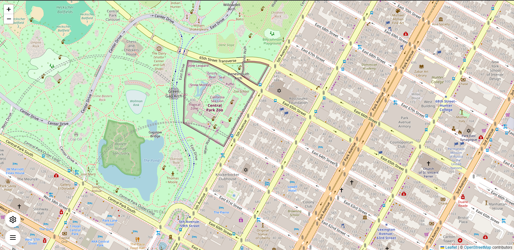
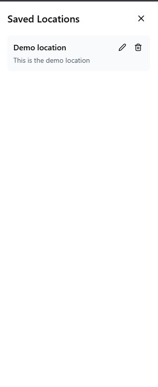
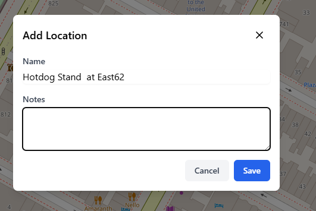

# 🌍 LocalSpots – Interactive Map Location Manager

LocalSpots is a modern web application that allows users to **explore, mark, and manage locations on an interactive map**. Built with a clean UI and persistent storage, it helps users save important places with notes and access them anytime.

---

## 🚀 Features

* 📍 **Interactive Map (Leaflet + OpenStreetMap)**
* ➕ **Add Custom Locations**

  * Click anywhere on the map to add a marker
  * Attach notes/description to each location
* 📂 **Sidebar Location List**

  * View all saved locations
  * Click to navigate to a location
* ⚙️ **User Settings**

  * Set a default map location
* 💾 **Local Storage Persistence**

  * Data is saved in the browser
* 🎨 **Modern UI**

  * Responsive layout with Tailwind CSS

---

## 🛠 Tech Stack

**Frontend:**

* React (with TypeScript)
* Vite

**Styling:**

* Tailwind CSS

**Map:**

* Leaflet.js
* OpenStreetMap

**State & Storage:**

* React Hooks
* Custom `useLocalStorage` Hook

---

## 📂 Project Structure

```
src/
│── components/
│   ├── Map.tsx              # Main map rendering + markers
│   ├── Sidebar.tsx          # Sidebar UI for locations
│   ├── LocationForm.tsx     # Add new location form
│   ├── SettingsForm.tsx     # Default location settings
│
│── hooks/
│   └── useLocalStorage.ts   # Custom hook for persistent state
│
│── types/
│   ├── location.ts          # Location type definitions
│   └── settings.ts          # Settings type definitions
│
│── App.tsx                  # Main app layout
│── main.tsx                 # Entry point
```

---

## ⚙️ Installation & Setup

1. Clone the repository:

```bash
git clone https://github.com/your-username/localspots.git
cd localspots
```

2. Install dependencies:

```bash
npm install
```

3. Run the development server:

```bash
npm run dev
```

4. Open in browser:

```
http://localhost:5173
```

---

## 🧠 How It Works

* The **Map component** renders the Leaflet map and handles user clicks to add markers.
* Locations are stored using a custom hook:

  * `useLocalStorage` → ensures data persists even after refresh.
* The **Sidebar** dynamically displays all saved locations.
* The **SettingsForm** allows users to define a default location.
* Clicking a location in the sidebar centers the map on that point.

---

## ⚠️ Current Issues / Improvements

* ❌ Marker interaction may not work correctly in some cases
* ❌ Default location reset not functioning properly
* ❌ Current location detection not implemented
* ❌ Map centering needs refinement

---

## 🔮 Future Enhancements

* 📍 Show current location (blue dot)
* 🔍 Search locations
* 🗺 Route/navigation support
* ☁️ Backend integration for cloud sync
* 📱 Mobile optimization

---

## 📸 Screenshots

*Add screenshots here (Map view, Sidebar, Add Location form)*
### 🗺 Map View


### 📂 Sidebar


### ➕ Add Location

---

## 💡 Inspiration

This project was built to demonstrate:

* Interactive map handling
* State persistence
* Clean component-based architecture

---

## 👨‍💻 Author

Aryan Saraogi
 Developer

---

## ⭐ If you like this project

Give it a star ⭐ and feel free to contribute!
